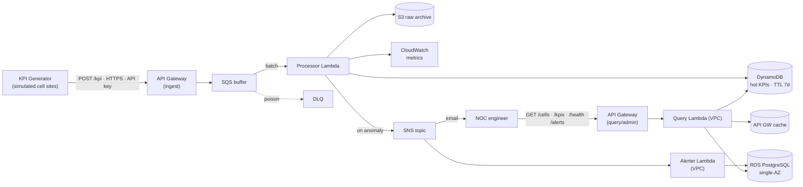

# CellWatch — RAN Observability & Anomaly-Detection Platform

A cloud-native platform that ingests per-cell Radio Access Network (RAN) KPIs,
persists them, detects anomalies (sleeping cells, congestion, KPI degradation),
raises alerts, and exposes a query/dashboard API for NOC engineers. Built for
**CSCI 4149 — Advanced Cloud Architecting** and provisioned entirely with
Terraform on AWS (Academy Learner Lab, `us-east-1`).

> **Design authority:** [`docs/OVERVIEW.md`](docs/OVERVIEW.md) is the single
> source of truth for every architectural decision, the NFR→architecture
> mapping, and the Well-Architected evidence. This README is the operational
> guide — how to deploy and run it. Operational playbooks live in
> [`docs/RUNBOOK.md`](docs/RUNBOOK.md).

---

## Architecture at a glance

The design splits a high-volume **data plane** (serverless, outside the VPC) from
a **control/read plane** (in-VPC, touches RDS). A KPI sample is durable in SQS and
S3 *before* anything relational is touched, so the telemetry path never depends on
RDS.



**Stack:** API Gateway · Lambda (Python 3.12 + Powertools) · SQS + DLQ · DynamoDB ·
S3 · RDS PostgreSQL · SNS · EventBridge · CloudWatch · KMS (CMK) · Secrets Manager,
all as Terraform. See [`docs/OVERVIEW.md` §6](docs/OVERVIEW.md) for the choice/
alternative/risk rationale behind each component.

---

## Repository layout

```
cellwatch/
  infra/            Terraform: vpc, data-plane, control-plane, monitoring, kms modules
  services/
    ingest/         API GW ingest handler
    processor/      SQS-triggered: store + detect + alert
    query/          read/admin API (VPC)
    alerter/        SNS-triggered: writes alert rows to RDS (VPC)
    migrate/        one-off RDS schema + seed
    common/         shared models, logging, detection, KPI schema
  generator/        simulated cell-site KPI generator (traffic source)
  loadtest/         k6 scripts + captured results (RESULTS.md)
  frontend/         static dashboard (live + embedded-evidence modes)
  docs/             OVERVIEW.md (design authority), RUNBOOK.md
  tests/            pytest suite (unit + moto-mocked AWS)
```

---

## Prerequisites

| Tool | Version | Notes |
|---|---|---|
| AWS credentials | — | Learner Lab `LabRole` creds (or a real account with equivalent perms), region `us-east-1` |
| Terraform | ≥ 1.15 | AWS provider `~> 5.0` |
| Python | 3.12 | via [`uv`](https://docs.astral.sh/uv/) — `uv sync` installs deps |
| k6 | any recent | only for the load tests |

```bash
uv sync          # create the venv and install dependencies
uv run pytest    # optional: run the test suite (31 tests)
```

---

## Deploy

The stack deploys with one `terraform apply`. Steps 1 and 4 are the only ones that
need explaining.

**1. Load AWS credentials.** In the Learner Lab, grab the credentials from *AWS
Details → AWS CLI*, then:
```bash
source infra/scripts/set-lab-creds.sh      # paste key / secret / session token
# verify the account it prints is the one you expect before continuing
```

**2. Build the Lambda artifacts** (zips the handlers + dependency layers into
`infra/build/`; re-run whenever `services/` or pinned deps change):
```bash
./infra/scripts/build_lambda_artifacts.sh
```

**3. Provision everything:**
```bash
cd infra
terraform init
terraform apply -var alert_email=you@example.com
```
RDS creation takes ~5–10 minutes on a first apply — the apply parking on the RDS
resource is expected, not a hang.

**4. Confirm the alert email + seed the database.** After apply, click the SNS
subscription-confirmation link that lands in `alert_email` (no click ⇒ no alert
emails). Then run the one-off migration to create the RDS schema and seed demo
cells/thresholds:
```bash
aws lambda invoke --function-name $(terraform output -raw migrate_function_name) --payload '{}' out.json
cat out.json      # expect {"status": "ok", "cells_seeded": 20}
```

**5. Grab the endpoints:**
```bash
terraform output
```
`ingest_url`, `query_url`, and the two `*_api_key_id`s are what the generator,
load tests, and dashboard consume. Fetch an API key's value with:
```bash
aws apigateway get-api-key --api-key $(terraform output -raw query_api_key_id) --include-value --query value --output text
```

---

## Run the generator

The generator simulates cell sites posting KPI time-series to the ingest API. A
short, gentle demo run (20 cells, ~4 req/s, 2.5 min, ~15% anomaly rate) reliably
lights up sleeping-cell/congestion/degradation anomalies:

```bash
INGEST_URL=$(terraform -chdir=infra output -raw ingest_url)
INGEST_KEY=$(aws apigateway get-api-key --api-key $(terraform -chdir=infra output -raw ingest_api_key_id) --include-value --query value --output text)

uv run python generator/simulate.py \
  --endpoint "$INGEST_URL" --api-key "$INGEST_KEY" \
  --cells 20 --interval 5 --anomaly-rate 0.15 --rounds 30
```

`--cells 1000 --interval 60` reproduces the modelled mid-size metro RAN
(`--rounds 0` runs forever). Full flags: `uv run python generator/simulate.py --help`.

---

## Run the load tests

Two k6 scripts sized around the NFRs, with full detail in
[`loadtest/README.md`](loadtest/README.md) and captured results in
[`loadtest/RESULTS.md`](loadtest/RESULTS.md):

- **`loadtest/ingest.js`** — sustained 100 rps + a 500 rps burst; checks ack p95
  and that SQS absorbs the burst (queue-depth poller captures the evidence k6
  can't).
- **`loadtest/query.js`** — warm-vs-cold cache scenarios for the before/after
  cache p95 number.

```bash
INGEST_URL=$(terraform -chdir=infra output -raw ingest_url)
INGEST_API_KEY=$(aws apigateway get-api-key --api-key $(terraform -chdir=infra output -raw ingest_api_key_id) --include-value --query value --output text)
INGEST_URL="$INGEST_URL" INGEST_API_KEY="$INGEST_API_KEY" k6 run loadtest/ingest.js
```

> ⚠️ **AWS Academy caution.** The 500 rps burst spikes Lambda `ConcurrentExecutions`
> hard. Vocareum enforces per-service **concurrency limits** (separate from the $50
> budget) that can **deactivate the account** if exceeded — this happened once
> during development. On a Learner Lab account, prefer the realistic ~85 rps peak,
> throttle via the API Gateway usage plan, and tell your instructor before running
> a high-rate test. See [`docs/OVERVIEW.md` §8](docs/OVERVIEW.md).

---

## Dashboard

A framework-free static dashboard over the query API lives in
[`frontend/`](frontend/). It runs in **live mode** (calls the deployed query API
directly from the browser — requires the CORS support that ships in the Terraform)
or **static-evidence mode** (renders a bundled JSON snapshot, works anywhere,
including after the AWS account is gone). Serve it locally:

```bash
cd frontend && python3 -m http.server 8000   # then open http://localhost:8000
```

Full details, evidence regeneration, and Cloudflare/GitHub Pages hosting in
[`frontend/README.md`](frontend/README.md).

---

## Observability

- **CloudWatch dashboard** — `terraform output dashboard_url` (ingest traffic,
  queue depth, Lambda health, anomaly counts, RDS, DynamoDB capacity).
- **Alarms** — ingest 5xx, DLQ depth, processor p95 duration, RDS CPU/connections
  (all in Terraform, all wired to the SNS topic).
- **Structured logs** — JSON with correlation IDs and X-Ray trace IDs via Lambda
  Powertools; query in CloudWatch Logs Insights, e.g. on
  `/aws/lambda/cellwatch-processor`:
  ```
  fields @timestamp, level, service, cell_id, function_request_id, message
  | filter message = "anomaly_detected"
  | sort @timestamp desc | limit 20
  ```

---

## Teardown & cost hygiene

```bash
cd infra && terraform destroy -var alert_email=you@example.com
```

RDS (`db.t3.micro`) is the only resource that bills continuously, so between work
sessions either destroy the stack or **stop/snapshot the RDS instance** (a merely
*stopped* instance is auto-started by AWS after 7 days — prefer snapshot-and-delete
for long gaps). Everything else is pay-per-request and costs ~nothing at rest. See
[`docs/OVERVIEW.md` §8](docs/OVERVIEW.md) for the full budget-hygiene notes.

---

## Learner Lab constraints & production gaps

The lab imposes real constraints that shaped the design: no NAT Gateway, single-AZ
RDS, a 10-concurrent-Lambda ceiling, and no custom IAM roles (everything runs as the
pre-baked `LabRole`). Each is turned into a documented, defensible decision — and
the intended production least-privilege IAM policies are written out in
[`infra/policies/`](infra/policies/) even though the lab can't enforce them.
Full "what I'd do in production and what the lab prevented" discussion in
[`docs/OVERVIEW.md` §8](docs/OVERVIEW.md).

---

## AI-assisted development disclosure

Per the assignment's policy: the architecture, design decisions, and system logic
are the author's own, captured in `docs/OVERVIEW.md` as the design authority.
Implementation was done with AI-assisted coding (Claude) working from that design
