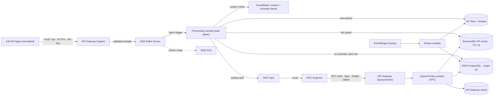
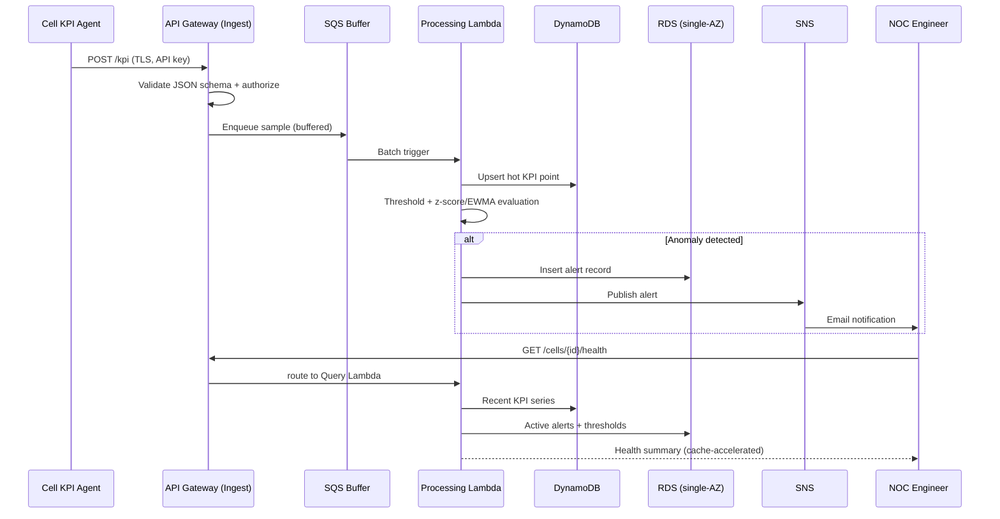

# CellWatch — RAN Observability & Anomaly Detection Platform
### CSCI 4149 Advanced Cloud Architecting — Term Project (Undergraduate Track) · Source of Truth

> **Status:** Foundation document. This is the single source of truth for the project and the input
> to all Claude Code sessions. Update it as decisions change so it never drifts from reality.
>
> **Name:** "CellWatch" is a placeholder — rename freely.
> **Deadline:** Report due **July 5th, 2026, 11:59 PM**. One-on-one TA demo around the deadline.
> **Graded WAF pillars:** Operational Excellence, Security, Reliability, Performance Efficiency.
> **Environment:** AWS Academy **Learner Lab** (long-lived, ~$50 budget, `LabRole`, us-east-1).
> Service availability reconciled against the lab's official list (updated 2025-06-24). Key
> lab-driven decisions: **RDS is single-AZ** (Multi-AZ not relied on), **Lambda capped at 10
> concurrent executions**, **Secrets Manager + KMS available**, **no NAT Gateway** (budget).

---

## 1. Concept & Domain

**Domain:** Telecommunications / Radio Access Network (RAN) operations — chosen to match real co-op
experience on a telco RAN team, which maximizes the Design-Decision-Defense and Technical-Depth
marks in the one-on-one (you are defending an architecture in a field you actually work in).

**What it is:** A cloud-native, OSS-style platform that ingests per-cell RAN KPIs at regular
intervals from cell sites, persists them, computes rolling statistics, detects anomalies
(sleeping cells, congestion, sudden KPI degradation), raises alerts, and exposes a query/dashboard
API for Network Operations Center (NOC) engineers.

Because we obviously cannot wire into live eNodeB/gNodeB feeds, **a KPI generator simulates cell
sites** posting realistic time-series. This is itself a design talking point: the ingest contract
(HTTP + JSON schema) is identical whether the producer is a simulator or a real OSS northbound
interface.

**KPIs modelled (per cell, per interval):** PRB utilization (DL/UL %), RRC connected users,
DL/UL throughput (Mbps), RSRP (dBm), RSRQ (dB), SINR (dB), handover success rate (%),
call/session drop rate (%), PRACH attempt count.

---

## 2. Scope: MVP vs Stretch

Everything graded is satisfied by the **MVP alone**. Stretch items add polish, not pillar coverage.
This split doubles as the "must-have vs nice-to-have" user-story requirement (§4.1 below).

**MVP (must build):**
- Ingest API → buffer → processing → hot store (DynamoDB) + raw archive (S3).
- Relational inventory/thresholds/alert history in RDS PostgreSQL (single-AZ; recovery via automated backups + PITR).
- Threshold + statistical (z-score / EWMA) anomaly detection.
- SNS email alerts on anomaly.
- Query/admin API (latest KPIs, history, cell health, alerts; cell + threshold CRUD).
- One caching layer on the read path.
- CloudWatch logs (structured), metrics, alarms, dashboard.
- Full Infrastructure-as-Code; load test producing a p95 number.

**Stretch (nice-to-have):**
- CloudWatch **anomaly-detection bands** as an adaptive, pattern-aware detector (the "AI" angle).
- EventBridge hourly rollups → trend aggregates in S3 + RDS.
- Static dashboard frontend (S3-hosted) over the query API.

> **Deferred:** ElastiCache Redis as a dedicated cache tier. API Gateway caching is the sole cache
> strategy going forward — no LabRole-support uncertainty to chase, no per-hour node cost. See §6.

---

## 3. Functional Requirements

### 3.1 Actors
- **Cell site KPI agent** (producer) — simulated generator posting samples.
- **NOC engineer** (primary consumer) — queries KPIs/health, receives alerts.
- **Network admin** — manages cell inventory and per-KPI thresholds.
- **System scheduler** (internal) — drives periodic rollups.

### 3.2 Functionalities
1. Ingest KPI samples per cell via authenticated HTTP API.
2. Validate and durably persist KPI time-series (hot + cold).
3. CRUD on cell/site inventory and per-cell/per-KPI alert thresholds.
4. Threshold-based **and** statistical anomaly detection on incoming samples.
5. Record alerts and notify the NOC (SNS email).
6. Query API: latest KPIs per cell, time-range history, current cell health summary, active alerts.
7. *(Stretch)* Scheduled rollups for trend analysis.
8. *(Stretch)* Visual dashboard of network health.

### 3.3 User Stories (by priority)

**Must-have**
- **US-1 (Ingest):** As a cell agent, I push KPI samples each interval so the platform reflects
  current network state.
- **US-2 (Detect & alert):** As a NOC engineer, I am alerted when a cell breaches a threshold or
  behaves anomalously, so I can act before customers are impacted.
- **US-3 (Triage):** As a NOC engineer, I query a cell's recent KPI history and current health so I
  can diagnose an incident.

**Nice-to-have**
- **US-4 (Config):** As an admin, I manage cells and thresholds without redeploying.
- **US-5 (Trends):** As an analyst, I view scheduled rollups for trend analysis.
- **US-6 (Dashboard):** As a NOC engineer, I see a visual network-health dashboard.
- **US-7 (Adaptive detection):** As an operator, I want anomaly detection that adapts to daily/weekly
  traffic patterns (CloudWatch anomaly bands) so I get fewer false positives at predictable peaks.

---

## 4. Non-Functional Requirements

Each NFR states a **measurable target**, the **capacity assumption** behind it, and the
**architectural decision** it drives. (The rubric explicitly rewards the NFR → architecture link.)

### 4.1 Capacity assumptions (drive all sizing)
- **Network size:** 1,000 cells (mid-size metro RAN).
- **Reporting interval:** 60 s/cell → ~1,000 samples/min ≈ **~17 samples/s average**.
- **Burst:** post-outage catch-up assumed **5× → ~85 samples/s peak**.
- **Payload:** ~10 KPIs per sample, ~1–2 KB JSON.
- **Read load:** ~50 concurrent NOC operators, ~20 read RPS, bursty during incidents.
- **Retention:** hot (DynamoDB) 7 days; raw (S3) 12 months; rollups 13 months.
- **Platform ceiling (lab):** max **10 concurrent Lambda executions**. This is a hard input, not a
  footnote: max processing throughput ≈ 10 ÷ avg-duration(s) req/s, so anything above that must be
  absorbed by the SQS buffer rather than by Lambda scale-out. The load test and the graceful-
  degradation story are both built around this number.

### 4.2 NFR table

| NFR | Target | Capacity basis | Architectural decision |
|---|---|---|---|
| Scalability (ingest) | Sustain 100 RPS, absorb 500 RPS burst with zero sample loss | ~17 avg / ~85 peak + headroom | SQS buffer absorbs burst above the 10-Lambda ceiling; DynamoDB on-demand; batch SQS trigger raises effective throughput per invocation |
| Scalability (read) | 50 concurrent / ~20 RPS, p95 stable under load | NOC sizing | Read cache shields the 10-Lambda ceiling; DynamoDB single-digit-ms reads |
| Availability | 99.9% on query/alert API (~8.77 h/yr) | Single-region Learner Lab; cost | Data plane on inherently multi-AZ managed services (Lambda/SQS/DynamoDB/S3); queue + S3 decouple ingest from RDS/processing outages; single-AZ RDS off the critical path |
| Latency | Read p95 < 300 ms (cached); ingest ack p95 < 500 ms; detect→alert < 2 min | Operator UX | Cache layer; async processing off the request path; batch SQS trigger |
| Durability | No loss once accepted; raw data 11 9's | Audit/forensics | S3 archive (11 9's); SQS+DLQ; DynamoDB PITR; RDS PITR |
| Security | TLS in transit; encryption at rest; authenticated APIs; least privilege | Compliance/data sensitivity | HTTPS-only API GW; SSE on all stores; API keys/authorizer; per-function IAM (prod) |

> **Why 99.9% not 99.99%:** the Learner Lab is effectively single-region, so honest multi-region
> active-active is out of scope and over budget. Document this trade-off explicitly — it reads as
> mature engineering, not a gap.

---

## 5. Architecture (Lean Hybrid)

**Design principle — control/data plane split:** the high-volume **data plane** (ingest →
process → store) is fully serverless and runs **outside the VPC** to avoid VPC cold-start penalties.
The **control/read plane** (queries, admin, alert history) runs in a **VPC** because it touches RDS
and the cache. This keeps the hot path fast and cheap and — critically — **keeps the entire
telemetry durability path off RDS**: a sample is durable in SQS and S3 before anything relational is
touched, so a single-AZ RDS outage degrades (no new alerts) without losing telemetry. RDS still
provides the sized instance and the documented recovery story for the rubric's Reliability and
Performance-Efficiency evidence.

### 5.1 High-level architecture



### 5.2 Critical end-to-end journey — anomaly detection → alert → triage



> For the report you'll redraw these in draw.io/Lucidchart with AWS icons, but this Mermaid is the
> canonical structure — keep it as the spec the polished diagrams must match.

### 5.3 Data model
- **DynamoDB (hot time-series):** `PK = CELL#<cell_id>`, `SK = TS#<epoch_ms>`; attributes = the KPI
  values; **TTL** attribute set to +7 days. On-demand capacity. Access pattern: "latest N points for
  a cell" and "cell points in [from,to]" — a perfect fit for partition-by-cell + sort-by-time.
- **RDS PostgreSQL (relational):** `cells` (id, site, lat/long, band, sector, status),
  `thresholds` (cell_id, kpi_name, min, max, severity), `alerts` (id, cell_id, kpi, value, type,
  severity, opened_at, cleared_at). Low write volume, relational integrity, ad-hoc queries.
- **S3 (cold):** raw samples partitioned `raw/dt=YYYY-MM-DD/cell=<id>/...`; rollups under `rollups/`.
  Lifecycle to Infrequent Access after 30 days.

### 5.4 Networking
Custom VPC, **2 AZs**, public + private subnets. RDS lives in **private**
subnets. VPC-bound Lambdas (Query/Config) sit in private subnets and reach AWS services via
**Gateway VPC endpoints for S3 and DynamoDB** (free) plus interface endpoints for SNS/SQS as needed.
The data-plane Lambdas stay out of the VPC entirely. **No NAT Gateway** — it is a per-hour budget
drain and the gateway endpoints remove the need for one. RDS spans 2 AZs at the subnet-group level
even though the instance itself is single-AZ, so promoting to Multi-AZ in production is a one-flag
change with no network rework.

---

## 6. Tech Stack — choices, alternatives, risks

| Component | Choice | Role | Why (vs alternative) | Limitation / risk |
|---|---|---|---|---|
| Ingest/Query API | **API Gateway (REST)** | TLS termination, auth, request validation | vs ALB: no instance to run, native API keys/usage plans, JSON schema validation at the edge | REST API quotas; request/response size limits |
| Compute | **AWS Lambda (Python 3.12)** | Stateless ingest/process/query | vs Fargate/EC2: zero idle cost, autoscale, fastest IaC + teardown in a time-boxed lab | Cold starts (mitigated: data-plane out of VPC; tune memory) |
| Buffering | **Amazon SQS + DLQ** | Decouple ingest from processing | vs Kinesis: simpler, cheaper, per-message retry + DLQ semantics; we don't need ordered shards or replay | No native ordering/replay (acceptable here) |
| Hot store | **DynamoDB (on-demand)** | High-write KPI time-series | vs RDS for time-series: predictable single-digit-ms writes at scale, auto-scaling, TTL expiry | Query flexibility limited to key design; no ad-hoc SQL |
| Relational store | **RDS PostgreSQL, single-AZ (db.t3.micro)** | Inventory, thresholds, alert history | vs DynamoDB for this data: relational integrity + ad-hoc queries; single-AZ because the lab restricts Multi-AZ, and this tier is deliberately off the telemetry critical path | Single-AZ = manual snapshot/PITR restore (not auto-failover) in lab; provisioning time; burstable CPU. **Uncheck Enhanced Monitoring** (lab-blocked). |
| Cold store | **Amazon S3** | Raw archive + rollups | vs keeping all in DynamoDB: 11 9's durability at far lower cost; lifecycle tiering | Eventual consistency on overwrite (not an issue for append) |
| Cache | **API Gateway caching** | Accelerate read path | Zero-infra, guaranteed available under LabRole, no per-hour node cost | Coarser TTL control than a dedicated cache tier (acceptable at this read volume) |
| Notifications | **SNS (email)** | Alert fan-out | vs SES: simpler topic/subscription model; vs SNS SMS: SMS needs sandbox/verified numbers in lab | Email only unless SMS sandbox cleared |
| Scheduling | **EventBridge (scheduled rule)** | Hourly rollups | vs cron on EC2: serverless, no instance, native IaC | — |
| Secrets & keys | **Secrets Manager** (RDS creds) + **KMS customer-managed key** (at-rest encryption) | No creds in code; encryption evidence | Both confirmed available in the lab — stronger than the SSM-only fallback: Secrets Manager gives rotation-capable credential storage, a CMK gives auditable, explicitly-owned encryption at rest | Small per-secret/per-key cost; CMK adds a key-policy to manage |
| Monitoring | **CloudWatch** (logs, metrics, alarms, dashboard, anomaly bands) | Observability + adaptive detection | Native, no extra infra; anomaly bands give pattern-aware detection without SageMaker | Anomaly bands need warm-up history; CloudTrail→CloudWatch logging is lab-blocked (note in report) |
| IaC | **Terraform** | Provision everything | vs CDK: avoids the Learner Lab `cdk bootstrap` IAM-role problem (see §8); deploys directly as LabRole | More verbose than CDK; state file management |
| Lambda libs | **AWS Lambda Powertools (Python)** | Structured logging, metrics, tracing | Directly supplies Operational-Excellence evidence (correlation IDs, JSON logs, EMF metrics) | Adds a dependency layer |

---

## 7. AWS Well-Architected mapping (the 30 graded report points)

For each rubric line, the **concrete artifact** you must produce.

### 7.1 Operational Excellence (7 pts) — all 4
- **Full IaC:** entire stack in Terraform, one `apply`. *(Artifact: `/infra` Terraform, `terraform plan` output.)*
- **Structured logs:** JSON logs with correlation IDs via Powertools. *(Artifact: CloudWatch Logs Insights query screenshot.)*
- **CloudWatch alarms:** ingest 5xx rate, DLQ depth > 0, processing duration p95, RDS CPU/connections. *(Artifact: alarms in IaC + console.)*
- **Runbook:** markdown playbook for "sleeping-cell storm," "DLQ backlog," "RDS snapshot/PITR restore." *(Artifact: `RUNBOOK.md`.)*

### 7.2 Security (8 pts) — all 5
- **No credentials in code:** RDS credentials in **Secrets Manager** (retrieved at runtime, never in
  source or env); non-secret config in SSM Parameter Store; identity via LabRole in lab.
- **Encryption in transit:** HTTPS-only API Gateway; RDS SSL enforced.
- **Encryption at rest:** **KMS customer-managed key** on DynamoDB, S3, SQS, and RDS (an owned,
  auditable CMK rather than default SSE — stronger evidence).
- **AuthN/Z:** API keys + usage plans on ingest; Lambda authorizer (or API key) on read/admin.
- **Least privilege:** documented per-function IAM policies (see production-gap below).

### 7.3 Reliability (8 pts) — all 4

**Framing (say this to the TA):** the critical telemetry path uses only inherently multi-AZ managed
services and never depends on RDS. An accepted KPI is durable in SQS + S3 *before* the relational
tier is touched, so a single-AZ RDS outage degrades (can't open new alerts / serve inventory
queries) without ever losing telemetry. Single-AZ is a lab constraint turned into a deliberate
critical-path decision.

- **Multi-AZ:** the data plane (Lambda, SQS, DynamoDB, S3, SNS) is multi-AZ/regional by AWS design —
  genuinely, not hand-waved. RDS is **single-AZ in the lab**; the documented production design is
  Multi-AZ synchronous standby (one-flag change — subnet group already spans 2 AZs).
- **Health checks:** `/health` endpoint; CloudWatch on RDS and Lambda; API GW reachability.
- **Graceful degradation:** SQS buffering + Lambda retries + DLQ — ingest absorbs bursts above the
  10-Lambda ceiling and survives a processing/RDS outage; poison messages quarantined; reads fall
  back to DynamoDB-only if cache or RDS is down.
- **RTO/RPO documented:** RPO ≈ 0 for accepted samples (durable in SQS/S3 before ack). For RDS:
  RPO ~5 min via **point-in-time recovery**; RTO in lab is a manual snapshot restore (be honest —
  tens of minutes) vs ~60–120 s automatic failover in the production Multi-AZ design. DynamoDB PITR
  enabled.

### 7.4 Performance Efficiency (7 pts) — all 3
- **Instance sizing justified:** RDS db.t3.micro (low relational volume, burstable);
  Lambda memory tuning (memory = CPU) chosen against the **10-concurrent
  ceiling** — right-sizing memory lowers duration, which directly raises max throughput
  (10 ÷ duration). *(Artifact: sizing rationale + tuning notes.)*
- **Caching layer:** API Gateway cache with TTL on hot reads.
- **Load test with p95:** k6 (or Locust/Artillery) against ingest and query endpoints, sized around
  the 10-Lambda ceiling; report p95 before/after cache and show the SQS queue absorbing burst.
  *(Artifact: load-test script + results table + p95 chart.)*

---

## 8. AWS Academy Learner Lab — constraints & production gaps

Reconciled against the lab's official service list (updated 2025-06-24). Use this section verbatim as
the basis for the brief's required "what I'd do in production and what the lab prevented" discussion.

**Confirmed available for our stack:** API Gateway, Lambda, SQS, SNS, DynamoDB, S3, EventBridge,
CloudWatch, VPC, RDS (single-AZ), Secrets Manager, KMS, CloudFormation. So the architecture stands
as designed — only the items below change. (ElastiCache is listed in the lab but deferred — see §2.)

- **IAM — cannot create roles at all** (only service-linked). Everything attaches the pre-baked
  `LabRole`. *Production:* each Lambda gets a scoped least-privilege role (e.g., the ingest Lambda
  only `sqs:SendMessage` to one queue; the query Lambda only `dynamodb:Query` + read on specific
  RDS/Secrets resources). *In lab:* everything assumes `LabRole`, so least privilege is **designed and
  documented but not enforced.** Write the intended policies anyway — that JSON is the evidence.
- **RDS — Multi-AZ not relied on; Enhanced Monitoring must be unchecked.** Single-AZ only, burstable
  db.t3 (micro–medium), gp2, ≤100 GB. See the Reliability reframe (§7.3): the telemetry path is kept
  off RDS so this constraint doesn't cost telemetry durability. **CloudFormation tip: specify the
  engine in lowercase** (`postgres`).
- **Lambda — max 10 concurrent executions.** Hard input to the load test and graceful-degradation
  story (§4.1, §7.3–7.4). The SQS buffer exists precisely to absorb bursts above this ceiling.
- **Budget (~$50) hygiene — exceeding it disables the account and wipes everything.** Compute left
  running is the fastest drain. Therefore: **no NAT Gateway** (use free S3/DynamoDB gateway
  endpoints); **stop or delete RDS at the end of each work session** (note: a stopped RDS instance is
  auto-started by AWS after 7 days, so prefer snapshot-and-delete for long gaps); the lab persists
  resources between sessions, so `terraform apply` rebuilds fast.
- **Region:** us-east-1 (us-west-2 also allowed). Pin everything to **us-east-1** for consistency.
- **Secrets Manager + KMS available** → upgrade the Security pillar accordingly (§7.2). Prefer these
  over the SSM-only fallback for credentials and a customer-managed encryption key.
- **SNS email, not SMS** (SMS needs sandbox/verified numbers).
- **CloudTrail→CloudWatch logging is lab-blocked** — you can create a trail but not wire it to
  CloudWatch Logs. Note this as a lab gap under Operational Excellence rather than trying to fix it.
- **IaC — Terraform (default).** It runs directly against the temporary `LabRole` credentials
  (found under **AWS Details** in the lab UI — access key, secret, session token) with no bootstrap
  stack. `cdk bootstrap` wants to create IAM roles + an asset bucket, which the role-restricted lab
  can reject; CloudFormation is the zero-bootstrap alternative if you prefer it over Terraform.
  Credentials rotate each session, so re-export them when you start a new session.

---

## 9. Implementation plan

### 9.1 Repository layout (private GitHub/GitLab)
```
cellwatch/
  infra/                 # Terraform: vpc, data-plane, control-plane, monitoring modules
  services/
    ingest/              # API GW + ingest validation
    processor/           # SQS-triggered: store + detect + alert
    query/               # read/admin API handlers (VPC)
    rollup/              # EventBridge-triggered aggregation
    common/              # shared models, logging, KPI schema
  generator/             # cell-site KPI simulator (load source)
  loadtest/              # k6 scripts + results
  docs/                  # OVERVIEW.md (this file), RUNBOOK.md, diagrams
  README.md              # architecture summary, prereqs, deploy steps
```

### 9.2 README must contain (graded)
Architecture summary · prerequisites (AWS creds/region, Terraform, Python, k6) · step-by-step
deploy (`terraform init/plan/apply`) · how to run the generator and load test · teardown.

### 9.3 AI-assisted code disclosure
The brief permits AI-assisted coding with **no mark penalty** but requires you to state the
AI-generated proportion and to have authored the *design and logic* yourself. Since you'll use Claude
Code: keep this OVERVIEW as the design authority, track the rough AI-generated percentage, and make
sure you can **trace a request end-to-end and defend every component** in the viva — that is what the
30-point meeting actually tests. Do not copy from external repos/tutorials; all code must be your own
(AI-generated-from-your-design counts; lifted-from-a-tutorial does not).

---

## 10. Build roadmap (Jun 30 → Jul 5)

| Phase | Days | Goal |
|---|---|---|
| 0 — Foundation | Day 1 | Repo + Terraform skeleton + VPC; export LabRole creds (AWS Details); KPI JSON schema |
| 1 — Data plane | Days 2 | API GW ingest → SQS → processing Lambda → DynamoDB + S3; generator posts traffic |
| 2 — Control plane | Days 2 | RDS + schema + seed; query/admin API + VPC Lambda; cache |
| 3 — Detect & alert | Day 3 | Threshold + z-score/EWMA detection; SNS email; CloudWatch metrics/alarms/dashboard |
| 4 — Harden | Day 4 | DLQ + retries; RDS snapshot/PITR restore drill; KMS + Secrets Manager + auth; `RUNBOOK.md` |
| 5 — Perf | Day 4 | k6 load test; capture p95; tune Lambda memory + cache |
| 6 — Report & demo | Days 5 | Polished draw.io diagrams; report; README; screenshots; demo dry-run |

Buffer is thin — protect Phase 1 (a working ingest→store path) above all; stretch items only after MVP is green.

---

## 11. Open decisions (defaults set — override anytime)
- **Name:** "CellWatch" (placeholder).
- **IaC:** Terraform *(recommended)*; CloudFormation is the zero-bootstrap alternative.
- **Lambda runtime:** Python 3.12 + Lambda Powertools.
- **Alerts:** SNS **email** (SMS is sandbox-restricted in lab).
- **RDS:** single-AZ db.t3.micro, Enhanced Monitoring off; recovery via backups + PITR.
- **Cache:** **API Gateway caching**. ElastiCache deferred (see §2).
- **Secrets/keys:** Secrets Manager for RDS creds + KMS CMK for at-rest encryption.
- **AI detection:** statistical (z-score/EWMA) for MVP; CloudWatch anomaly bands as stretch.
- **Frontend dashboard:** stretch only.

> **Still genuinely open (needs your call):** (1) final network size assumption (1,000 cells) —
> adjust if you want a bigger/smaller scaling story; (2) whether to attempt the CloudWatch
> anomaly-bands stretch at all.
